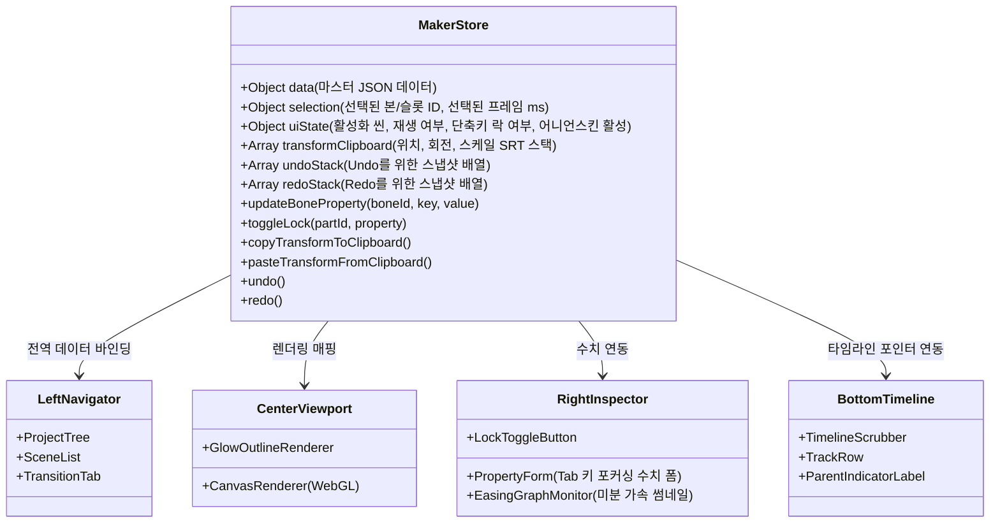

# 2D Skeletal Animation System - Master Blueprint (통합 설계서)

본 문서는 `ani.inkinno.com`에서 구동될 2D 뼈대 애니메이션 시스템(Core Engine, Player, Maker)의 전역 아키텍처 및 상세 설계 사양서입니다. 다른 AI 협업 에이전트와 인간 개발자가 이 시스템의 일관성을 잃지 않고 언제든 세부 모듈을 구축하고 확장할 수 있도록 모든 인터페이스, 데이터 규격, 성능 기준, 라이프사이클 흐름을 명세합니다.

---

## 1. 전역 파일 시스템 아키텍처 (File Tree Map)

모든 모듈은 완벽히 디커플링(Decoupling)되어 독립적으로 빌드 및 테스트가 가능합니다. 중복 코드를 제거하기 위해 `shared` 디렉토리에 공통 UI와 유틸리티를 격리하고, `core-engine`은 DOM이나 브라우저 전용 API에 의존하지 않는 순수 수학 및 가상 연산 로직으로만 설계하여 이식성을 높입니다.

```
animation2D/
├── index.html                  # 메인 웰컴 및 포털 페이지 (ani.inkinno.com/)
├── css/
│   └── global.css              # 프리미엄 공통 디자인 시스템 (Color, Glassmorphism, Font)
├── core-engine/
│   ├── index.js                # Core Engine 통합 진입점
│   ├── matrix.js               # 가속 행렬 및 아핀 변환 (Translation, Rotation, Scale) 연산 모듈
│   ├── kinetics.js             # 포워드 키네마틱스(FK) 및 월드 변형 상속 모듈
│   ├── interpolation.js        # 256단계 Cubic-Bezier 이징 룩업테이블(LUT) 및 보간 엔진
│   ├── bounds.js               # 관절부 파편화 방지를 위한 동적 경계 매칭(Dynamic Boundary Matching) 모듈
│   └── pool.js                 # 가비지 컬렉션 방지용 오브젝트 풀링(Object Pooling) 관리자
├── player/
│   ├── index.html              # 플레이어 구동 페이지 (ani.inkinno.com/player/)
│   ├── css/
│   │   └── player.css          # 플레이어 커스텀 스타일 (반응형 수직 적층 레이아웃)
│   ├── js/
│   │   ├── main.js             # 플레이어 진입 및 샌드박스 인젝션 API
│   │   ├── viewport.js         # 가용 영역 계산 기반 반응형 WebGL Canvas 설정 모듈
│   │   ├── downloader.js       # 비동기 다운로드 큐 및 씬 전환 인터럽트(Abort) 처리기
│   │   ├── controller.js       # 양방향 스크롤 매핑 및 단방향 트리거 컨트롤러
│   │   ├── persistence.js      # IndexedDB / LocalStorage 기반 영속 상태 저장 및 LIFO 복구 모듈
│   │   └── optimizer.js        # 정적 대기 상태(Idle State) 리소스 및 부분 전력 루프 관리자
│   └── app.js                  # 플레이어 실행 통합 바인딩 코드
├── maker/
│   ├── index.html              # 메이커 저작도구 페이지 (ani.inkinno.com/maker/)
│   ├── css/
│   │   └── maker.css           # 메이커 커스텀 스타일 (4분할 레이아웃 및 다크모드 글래스모피즘)
│   ├── js/
│   │   ├── main.js             # 메이커 애플리케이션 진입점
│   │   ├── store.js            # 전역 데이터 상태 관리자 (타임라인, 파츠, 선택 상태, Undo/Redo)
│   │   ├── pseudo3d.js         # 5개 각도 가중치 보간 의사 3D 렌더러
│   │   ├── input-handler.js    # 수치 기반 조작계 및 키보드 단축키 포커싱 제어 모듈 (Gizmo 배제)
│   │   ├── layer-guard.js      # 스케일 연동 자동 레이어 스왑 및 속성 락킹 모듈
│   │   └── workflow.js         # 트랜스폼 클립보드 스택, 어니언 스킨, 이징 곡선 프리뷰 모듈
│   └── app.js                  # 메이커 인터페이스 통합 제어 코드
└── shared/
    ├── css/
    │   └── common-ui.css       # 공통 UI 컴포넌트 디자인 스타일 (버튼, 입력 필드 등)
    └── js/
        ├── schema-validator.js # JSON 스키마 규격 검증 모듈
        └── utils.js            # 공통 유틸리티 (도형 계산, 색상 파싱 등)
```

---

## 2. 마스터 데이터 스키마 규격 (Master JSON Schema)

엔진, 플레이어, 메이커가 상호 교환하는 단일 파일 데이터의 표준 규격 사양입니다. 모든 좌표와 변형값은 소수점 행렬 연산을 위해 정밀한 실수(Float) 형식으로 표현됩니다.

```json
{
  "meta": {
    "version": "1.0.0",
    "generator": "2D-Skeletal-Maker",
    "renderMode": "SPRITE_RIGID_HARNESS"
  },
  "library": {
    "sprites": [
      { "id": "img_arm_upper", "type": "bitmap", "src": "data:image/webp;base64,UklGRi4AAABXRUJQVlA4TCEAAAAv..." },
      { "id": "img_arm_lower", "type": "bitmap", "src": "data:image/webp;base64,UklGRi4AAABXRUJQVlA4TCEAAAAv..." },
      { "id": "img_sword", "type": "bitmap", "src": "data:image/webp;base64,UklGRi4AAABXRUJQVlA4TCEAAAAv..." },
      { "id": "img_shield", "type": "bitmap", "src": "data:image/webp;base64,UklGRi4AAABXRUJQVlA4TCEAAAAv..." }
    ]
  },
  "skeleton": {
    "bones": [
      { "id": "root", "parent": null, "x": 0.0, "y": 0.0, "rotation": 0.0, "scaleX": 1.0, "scaleY": 1.0, "lengthRatio": 1.0 },
      { "id": "shoulder_R", "parent": "root", "x": 150.0, "y": 200.0, "rotation": 0.0, "scaleX": 1.0, "scaleY": 1.0, "lengthRatio": 1.5 },
      { "id": "elbow_R", "parent": "shoulder_R", "x": 0.0, "y": 120.0, "rotation": 0.0, "scaleX": 1.0, "scaleY": 1.0, "lengthRatio": 1.2 }
    ],
    "slots": [
      { 
        "id": "slot_arm_upper_R", 
        "bone": "shoulder_R", 
        "defaultAsset": "img_arm_upper", 
        "zIndex": 5, 
        "pivot": { "x": 0.5, "y": 0.05 },
        "stretchMode": "ASPECT_LOCKED" 
      },
      { 
        "id": "slot_weapon_R", 
        "bone": "elbow_R", 
        "defaultAsset": "img_sword", 
        "zIndex": 6, 
        "pivot": { "x": 0.1, "y": 0.9 },
        "stretchMode": "FREE_SCALE" 
      }
    ]
  },
  "animations": {
    "punch_sequence": {
      "duration": 2000,
      "timeline": {
        "shoulder_R": {
          "rotation": [
            { "time": 0, "value": 0.0, "easing": [0.25, 0.1, 0.25, 1.0] },
            { "time": 500, "value": 45.0, "easing": [0.25, 0.1, 0.25, 1.0] }
          ]
        },
        "elbow_R": {
          "scaleY": [
            { "time": 0, "value": 1.0, "easing": [0.42, 0.0, 0.58, 1.0] },
            { "time": 300, "value": 0.3, "easing": [0.42, 0.0, 0.58, 1.0] }
          ]
        },
        "slot_weapon_R": {
          "scaleX": [
            { "time": 0, "value": 1.0, "easing": [0.25, 0.1, 0.25, 1.0] },
            { "time": 300, "value": 2.0, "easing": [0.25, 0.1, 0.25, 1.0] }
          ],
          "scaleY": [
            { "time": 0, "value": 1.0, "easing": [0.25, 0.1, 0.25, 1.0] },
            { "time": 300, "value": 2.0, "easing": [0.25, 0.1, 0.25, 1.0] }
          ],
          "assetSwap": [
            { "time": 0, "assetId": "img_sword" },
            { "time": 1000, "assetId": "img_shield" }
          ],
          "zIndexKeyframe": [
            { "time": 0, "value": 6 },
            { "time": 500, "value": 4 }
          ]
        }
      }
    }
  }
}
```

### 스키마 핵심 규칙
- `lengthRatio`: 인체의 비례 안정을 수치화하기 위해, 메인 벤치마크 본(두상/얼굴 길이 등)을 기준값 1.0X로 설정한 하위 뼈대의 상대적 고유 정적 결합 길이 배수입니다.
- `stretchMode`: 본의 스케일 팽창에 따라 이미지가 신축될 때, `ASPECT_LOCKED`은 가로/세로 비율을 동일하게 유지하여 찢어짐을 방지하며, `FREE_SCALE`은 메이커에서 정한 값을 직접 렌더링에 매핑합니다.
- `assetSwap`: 타임라인상의 특정 프레임 시간에 장비(무기, 갑옷 등)를 실시간 스왑하는 데이터 노드입니다.

---

## 3. 상태 및 데이터 흐름도 (State & Data Flow Map)

시스템의 라이프사이클에 맞춰 메모리, 네트워크, 렌더링 루프가 상호 작용하는 전체 시퀀스입니다.

```mermaid
sequenceDiagram
    autonumber
    participant U as User
    participant P as Player (Client)
    participant E as Core Engine
    participant DB as LocalStorage / IndexedDB

    U->>P: 페이지 접속 (JSON 스키마 로딩 명령)
    P->>DB: 기존 유저 최종 세이브 스냅샷 조회 (LIFO)
    alt 세이브 스냅샷 존재 시
        DB-->>P: 이전 체크포인트 데이터 반환
        P->>P: LIFO 방식으로 세이브 포인트 기준 다운로드 우선순위 재배정
    else 세이브 스냅샷 미존재 시
        P->>P: 0ms 기준 기본 순차 다운로드 큐 생성
    end

    P->>P: 에셋 프리로딩 및 다운로드 큐 가동
    Note over P: 100MB 이상: 씬 단위 순차 실시간 다운로드<br/>100MB 미만: 전체 일괄 프리로딩
    P->>P: 로딩 인디케이터 UI 화면 송출

    E->>E: 가비지 컬렉션을 막기 위한 메모리 풀링(Object Pooling) 사전 할당
    E->>E: 모든 애니메이션 Cubic-Bezier 곡선을 256단계 LUT 배열로 사전 미분 베이킹
    
    P-->>U: 로딩 완료 및 메인 애니메이션 뷰포트 노출
    
    rect rgb(30, 30, 40)
        Note right of E: requestAnimationFrame (60fps 무형 루프 시작)
        P->>E: 현재 경과 시간 (Delta Time) 및 스크롤 델타 매핑 전달
        E->>E: LUT 참조하여 이징 보간 SRT 값 초고속 탐색
        E->>E: 포워드 키네마틱스(FK) 계산 (M_world = M_parent * M_local)
        E->>E: 동적 경계 매칭 (자식 피봇 스케일을 부모 종단부 크기에 매칭)
        E->>E: Z-Index 스왑 및 WebGL 드로우 큐 배치 정렬
        E->>P: 계산 완료된 변환 행렬 버퍼 송신
        P->>P: WebGL 하드웨어 가속 렌더링 실행 (드로우콜 3회 이하 통제)
        P->>DB: 실시간 진행 상황 스냅샷 비동기 플러싱 (Auto-Save)
    end

    alt 재생 완료 또는 대기 상태 돌입 (Idle State)
        P->>E: 정적 대기 상태(Idle State) 모드 전이 명령
        E->>E: 메인 타임라인 연산 휴면 전환 (CPU 점유율 보존)
        E->>E: 부분 전력 애니메이션(미세 호흡, 안구 깜빡임 등) 최소 정적 루프만 가동
        E->>P: 최소 행렬 계산 결과 전송
        P->>P: 60fps 부드러운 유희 상태 유지 및 기기 전력 효율성 달성
    end

    U->>P: 페이지 이탈 또는 종료
    P->>E: 라이프사이클 종료 명령 (Lifecycle Termination)
    E->>E: 모든 렌더링 루프 및 계산 스택 물리적 셧다운
    E->>E: 가비지 컬렉터 부담 방지를 위해 Object Pool 전체 정적 메모리 명시적 소거
```



---

## 4. 메이커 UI 컴포넌트 맵 (Maker Component Architecture)

메이커는 수치 기반의 정밀하고 에러 없는 제어가 필수적이므로 마우스 드래그 변형(Gizmo)을 배제하고, 우측 입력 폼과 키보드 단축키 포커싱을 통해 신속하고 안정적인 변형을 집행합니다.

### 4분할 화면 레이아웃 스키마
```
+---------------------------------------------------------------------------------------------------+
|  1 영역 - 좌측 관리형 탐색기 사이드바          |  2 영역 - 중앙 실시간 WebGL 뷰포트                       |
|  - Project Tree (뼈대 계층 구조)              |  - 가용 영역 자동 환산 종횡비 Canvas (상단 정렬)            |
|  - Scene List Manager (세부 씬 제어)          |  - 기즈모 변형 금지 / 클릭 시 Glow 하이라이트 경계선        |
|  - Transition Tab (씬 전환 인터페이스)         |                                                           |
+-----------------------------------------------+---------------------------------------------------+
|  3 영역 - 우측 속성 데이터 편집 패널 (Tab 키 커서 이동)                                                   |
|  - XYZ 속성 수치 입력창 (Rotation Focus -> Tab 누르면 ScaleXY Focus 전이)                         |
|  - 수동 락킹 버튼 (Lock Toggle) / Cubic-Bezier 이징 미분 곡선 가상 운동 에너지 썸네일 프리뷰          |
+---------------------------------------------------------------------------------------------------+
|  4 영역 - 하단 타임라인 시퀀서 및 계층 종속성 가이드                                                     |
|  - ms 단위 타임라인 트랙 및 재생 바 (Scrubber)                                                    |
|  - 각 파츠 노드별 종속된 부모 본 ID의 상시 인디케이터 라벨 표출                                           |
+---------------------------------------------------------------------------------------------------+
```

### 전역 상태 저장소 (Store) 아키텍처



---

## 5. 단계별 고도화 로드맵 (Phase 1 ~ Phase 4)

- **Phase 1 (MVP 단계 - 현 작업 타깃)**: 아핀 변환(SRT) 계산기, 로컬 JSON 데이터 내보내기/불러오기가 탑재된 4분할 저작도구(Maker), 샌드박스 WebGL 캔버스 출력 및 상태 영속화가 내장된 플레이어(Player) 핵심 뼈대 구현.
- **Phase 2 (수치 고도화 및 최적화)**: 256단계 Cubic-Bezier 이징 룩업테이블(LUT) 보간 및 Squash & Stretch 가속 안정화.
- **Phase 3 (인터랙션 및 이벤트)**: 타임라인 내 사운드 트리거, 외부 웹 링크 이동, 레이어 스왑(Z-Index Keyframe) 기능의 완전 매핑.
- **Phase 4 (Headless 렌더링 비디오 익스포터)**: 브라우저 캡처가 아닌 프레임 단위 무손실 시퀀스 이미지를 서버 혹은 로컬 FFmpeg/WebCodecs로 고정 속도 비디오 파일로 패키징하는 Headless 파이프라인 완성.

---

## 6. 개발 원칙 및 검수 규약 (QA Checklist)
1. **SOLID & DRY 원칙**: 모든 변환 행렬 연산은 `core-engine/matrix.js`에서만 일괄 집행하고, 메이커와 플레이어는 절대로 이를 자체 연산하지 않고 수입하여 재사용합니다.
2. **모듈화 극대화**: 각 모듈의 인터페이스 경계선은 완벽히 차단하며, 외부 UI의 상태 전이를 유발하는 이벤트 등은 콜백과 `Store` 옵저버를 통해서만 흘러가도록 규정합니다.
3. **가비지 컬렉션리스(GC-free) 준수**: 런타임 재생 루프 내부의 `new` 키워드를 엄격히 제한하고, `core-engine/pool.js`를 통해 가상 행렬 객체를 리사이클합니다.
4. **수동 직접 검수**: 코드를 생성 또는 편집한 뒤에는 시스템에만 의존하지 않고, 특수 문자 및 신택스 오작동 방지를 위해 코드의 상단부터 종단까지 개발자가 눈으로 직접 읽어 세밀히 검수합니다.
